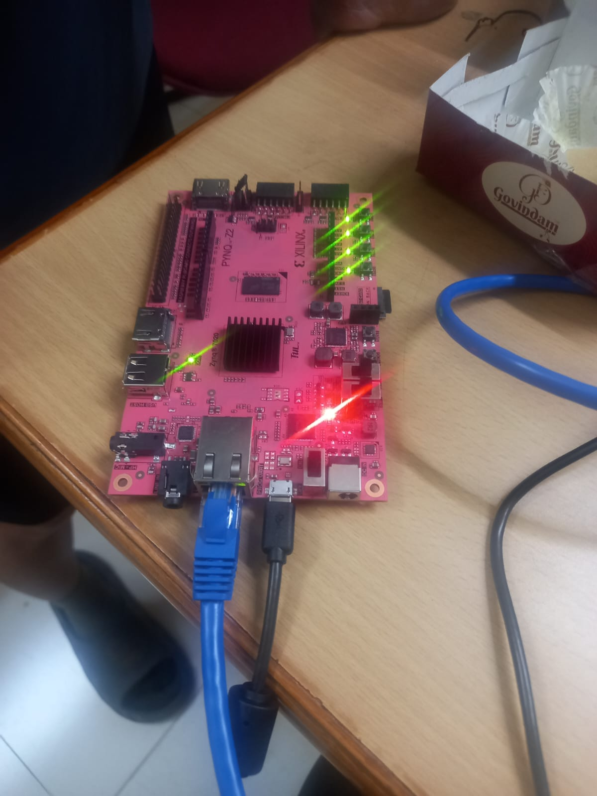
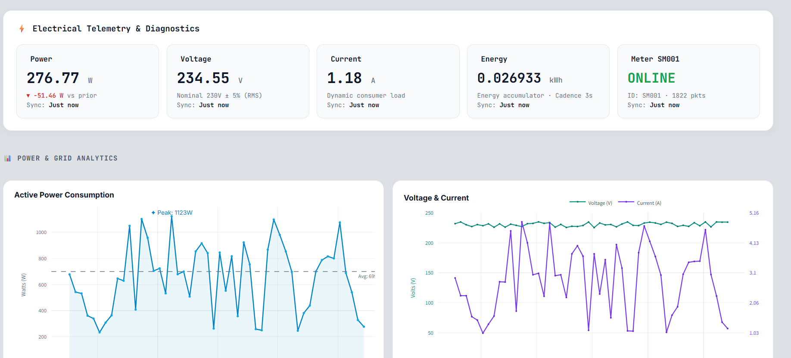
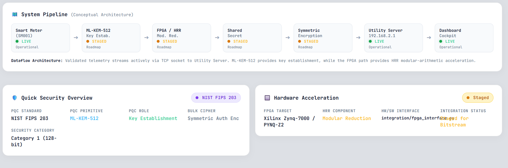
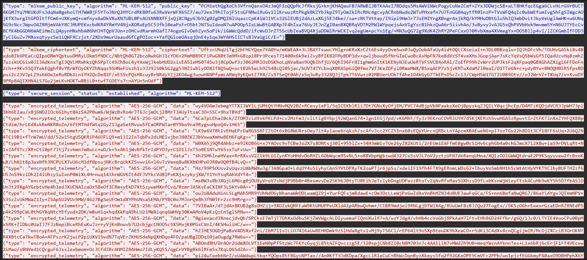
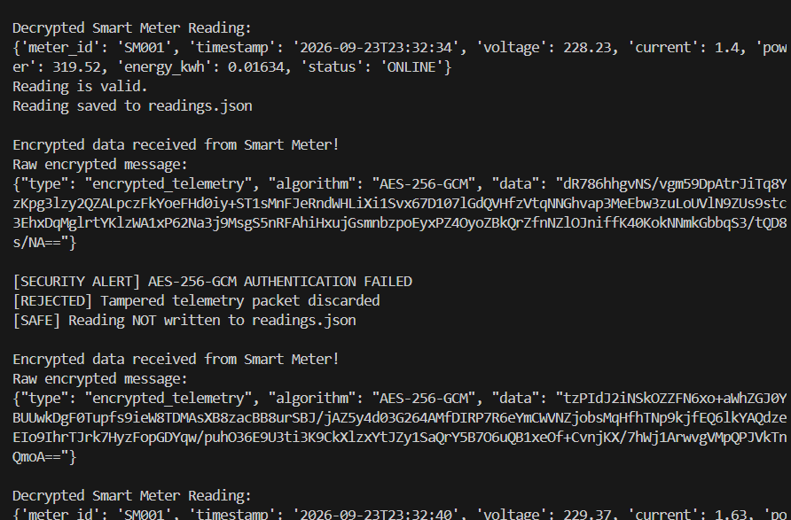
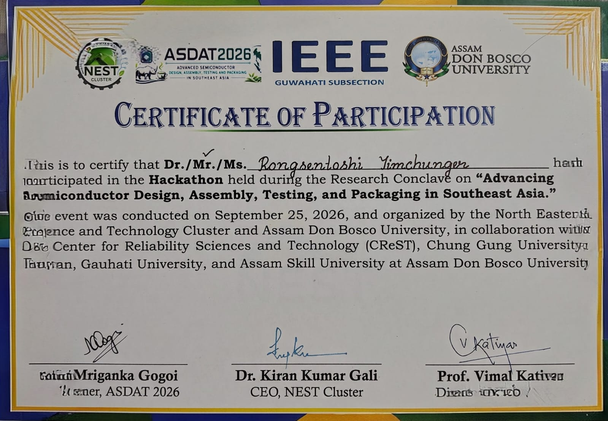

# Quantum Protect

## Post-Quantum Secure Smart Meter Communication

Quantum Protect is an end-to-end smart-meter security prototype combining **post-quantum key establishment, authenticated telemetry encryption, FPGA hardware acceleration, embedded systems, secure networking, and live cybersecurity demonstrations**.

The prototype is built around a **PYNQ-Z2**. It uses **ML-KEM-512** for post-quantum key establishment and **AES-256-GCM** to protect smart-meter telemetry.

> **Architecture boundary:** ML-KEM-512 and secure telemetry processing currently run on the PYNQ-Z2 ARM processor. The FPGA programmable logic provides an HRR modular-arithmetic accelerator accessed through AXI4-Lite. The complete ML-KEM algorithm is not implemented as a full FPGA datapath in this prototype.

---

## System Architecture

```text
                         QUANTUM PROTECT

                 ┌─────────────────────────┐
                 │        PYNQ-Z2          │
                 │      Smart Meter        │
                 └────────────┬────────────┘
                              │
                    ┌─────────▼─────────┐
                    │   ARM Processor    │
                    │                    │
                    │  Smart Meter       │
                    │  ML-KEM-512        │
                    │  AES-256-GCM       │
                    └─────────┬─────────┘
                              │
                         AXI4-Lite / MMIO
                              │
                    ┌─────────▼─────────┐
                    │   FPGA / PL        │
                    │                    │
                    │ HRR Accelerator   │
                    │ (a × b) mod 3329  │
                    └─────────┬─────────┘
                              │
                       Ethernet / TCP
                           Port 5000
                              │
                    ┌─────────▼─────────┐
                    │  Utility Server   │
                    │                    │
                    │ ML-KEM decap      │
                    │ AES-GCM verify    │
                    │ Decrypt / validate│
                    │ Store telemetry   │
                    └─────────┬─────────┘
                              │
                        readings.json
                              │
                    ┌─────────▼─────────┐
                    │ Streamlit         │
                    │ Dashboard         │
                    └───────────────────┘
```

---

## Cryptographic Pipeline

```text
ML-KEM-512
    │
    ▼
32-byte shared secret
    │
    ▼
AES-256-GCM
    │
    ▼
Encrypted telemetry
    │
    ▼
Ethernet / TCP
    │
    ▼
Utility Server
    │
    ▼
Authenticate + decrypt + validate
```

### ML-KEM-512

ML-KEM-512 is used for post-quantum key establishment.

Current parameter sizes:

| Artifact | Size |
|---|---:|
| Public key | 800 bytes |
| Private key | 1632 bytes |
| Ciphertext | 768 bytes |
| Shared secret | 32 bytes |

The shared session secret is derived locally by the endpoints rather than transmitted as a plaintext network field.

### AES-256-GCM

After the ML-KEM session is established, AES-256-GCM protects the smart-meter telemetry and provides authenticated integrity for the encrypted payload.

Telemetry includes values such as:

- Meter ID
- Voltage
- Current
- Power
- Energy
- Status

---

## FPGA Acceleration

The FPGA implements an HRR modular-arithmetic accelerator for:

```text
r = (a × b) mod 3329
```

The block is controlled through AXI4-Lite / memory-mapped registers.

```text
A       0x00
B       0x04
CONTROL 0x08
STATUS  0x0C
RESULT  0x10
```

### Physical validation

A direct test on the PYNQ-Z2 produced:

```text
A = 7
B = 9

(7 × 9) mod 3329 = 63

Hardware Result = 63
PASS
```

The FPGA RTL, AXI wrapper, Vivado implementation, bitstream generation, PYNQ deployment and physical hardware path were validated.

---

## Project Components

### Smart Meter

The PYNQ-Z2 generates voltage, current, power, energy and status data and periodically sends encrypted telemetry to the Utility Server.

### Utility Server

The Windows server performs:

1. ML-KEM decapsulation
2. Session-secret derivation
3. AES-GCM authentication
4. AES-GCM decryption
5. Telemetry validation
6. Persistence to `server/readings.json`

### Dashboard

The Streamlit dashboard visualizes the accepted telemetry, including live KPIs, historical charts and system/security status.

---

# Security Demonstrations

## 1. Wire Eavesdropping

**Tool:** Wireshark

A passive observer captures the real TCP traffic on port 5000.

```text
tcp.port == 5000
```

The observer can see network metadata, protocol messages and an AES-256-GCM encrypted telemetry payload, but the meter values are not exposed as plaintext inside the encrypted payload.

## 2. ML-KEM-512 Key Interception

**Tool:** Passive WinDivert observer

The real handshake exposes:

```text
Public key  — 800 bytes
Ciphertext  — 768 bytes
Protocol metadata
```

The ML-KEM private key and 32-byte shared session secret are not transmitted as wire fields.

The repository includes `integration/mlkem_attacker.py` for passive observation of the real handshake.

## 3. Man-in-the-Middle Tampering

**Tool:** WinDivert / PyDivert

A controlled attacker intercepts a real encrypted telemetry packet, modifies one ciphertext character while preserving the packet length, and forwards the packet to the Utility Server.

The server detects the modification using AES-256-GCM authentication and rejects the corrupted reading:

```text
[SECURITY ALERT] AES-256-GCM AUTHENTICATION FAILED
[REJECTED] Tampered telemetry packet discarded
[SAFE] Reading NOT written to readings.json
```

Subsequent legitimate packets can continue to be processed normally.

---

## Testing and Validation

The project has been validated across multiple layers:

### ML-KEM-512

- Encapsulation / decapsulation tested
- Matching shared secret verified
- Public key: 800 B
- Ciphertext: 768 B
- Shared secret: 32 B

### FPGA

- HRR RTL validation
- AXI4-Lite interface validation
- Physical PYNQ-Z2 test
- Known case: `(7 × 9) mod 3329 = 63`
- Random and invalid-input interface tests documented

### Secure Telemetry

- Telemetry generation
- AES-256-GCM encryption
- Network transmission
- Server authentication / decryption
- Validation and persistence

### Dashboard

- Live telemetry
- Historical analytics
- Automatic refresh
- Status monitoring

---

## Project Evidence

### Physical PYNQ-Z2 prototype



### Live telemetry dashboard



### System pipeline and security view



### Security 1 — network eavesdropping

Wireshark was used to inspect the real Ethernet/TCP traffic and observe the encrypted telemetry application messages.



### Security 3 — controlled MitM tampering

A real encrypted telemetry packet was modified in transit and the Utility Server rejected the tampered ciphertext through AES-256-GCM authentication.



### Event participation




## Repository Structure

```text
crypto/          ML-KEM and secure-data functions
smart_meter/     PYNQ smart-meter runtime
hrr/             HRR RTL and tests
fpga_interface/  Python FPGA interface and tests
fpga/            PYNQ deployment artifacts (.bit/.hwh/.xsa)
integration/     Integration and security demonstrations
server/          Utility Server
dashboard/       Streamlit dashboard
vivado/          Clean Vivado source/TCL artifacts
docs/            Project summary and demonstration documentation
```

---

## Running the Prototype

### Windows Utility Server

```powershell
cd "C:\path\to\Quantum-Protect"
.\.venv\Scripts\python.exe .\server\server.py
```

### PYNQ-Z2 Smart Meter

From a Windows terminal:

```bash
ssh xilinx@<PYNQ-IP>
```

Then on the PYNQ:

```bash
cd /home/xilinx/jupyter_notebooks/QuantumSecurity

export SERVER_HOST=<WINDOWS-ETHERNET-IP>
export SERVER_PORT=5000
export QUANTUM_FPGA=1
export HRR_BITSTREAM=/home/xilinx/jupyter_notebooks/QuantumSecurity/fpga/hrr_bd_wrapper.bit

sudo -E /usr/local/share/pynq-venv/bin/python3 smart_meter/smart_meter.py
```

### Streamlit Dashboard

```powershell
cd "C:\path\to\Quantum-Protect"
.\.venv\Scripts\python.exe -m streamlit run .\dashboard\app.py
```

### Scenario 3

Run from an **Administrator PowerShell**:

```powershell
cd "C:\path\to\Quantum-Protect"
.\.venv\Scripts\python.exe integration\mitm_attack.py --target-ip <PYNQ-IP> --server-port 5000 --pos 16 --count 1
```

### Scenario 2 passive observer

Run from an **Administrator PowerShell**:

```powershell
cd "C:\path\to\Quantum-Protect"
.\.venv\Scripts\python.exe integration\mlkem_attacker.py
```

---

## Technology Stack

| Layer | Technology |
|---|---|
| Hardware | PYNQ-Z2 / Xilinx Zynq-7000 |
| FPGA RTL | Verilog |
| FPGA Toolchain | Vivado |
| Hardware Interface | AXI4-Lite / MMIO |
| Post-Quantum Crypto | ML-KEM-512 |
| Symmetric Crypto | AES-256-GCM |
| Embedded Software | Python |
| Networking | Ethernet / TCP |
| Backend | Python |
| Dashboard | Streamlit |
| Packet Analysis | Wireshark |
| Security Testing | WinDivert / PyDivert |

---

## Limitations and Future Scope

The current prototype is a research and demonstration system.

Current limitations:

- ML-KEM-512 is not implemented as a complete all-hardware FPGA datapath.
- Replay resistance is not fully demonstrated.
- Explicit cryptographic device/peer authentication is not yet implemented.

Future extensions include:

- Full hardware ML-KEM acceleration
- Device identity and endpoint authentication
- Replay protection
- Deeper FPGA optimization and benchmarking
- Larger smart-grid deployment

---

## Event

Quantum Protect was developed and presented at the Hackathon held during the Research Conclave on:

**“Advancing Semiconductor Design, Assembly, Testing, and Packaging in Southeast Asia”**

**September 25, 2026 — Assam Don Bosco University**

---

## Team

**Rongsentoshi Yimchunger**  
**Dhritiman Boro**

### Mentor

**Mriganka Gogoi**

---

## Disclaimer

Quantum Protect is a research and demonstration prototype. Security demonstrations show the behavior of the implemented system under controlled conditions and should not be interpreted as a claim that every conceivable attack is impossible.
